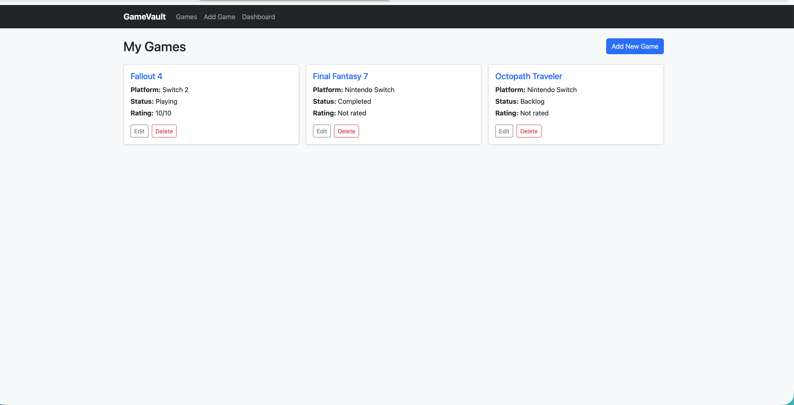
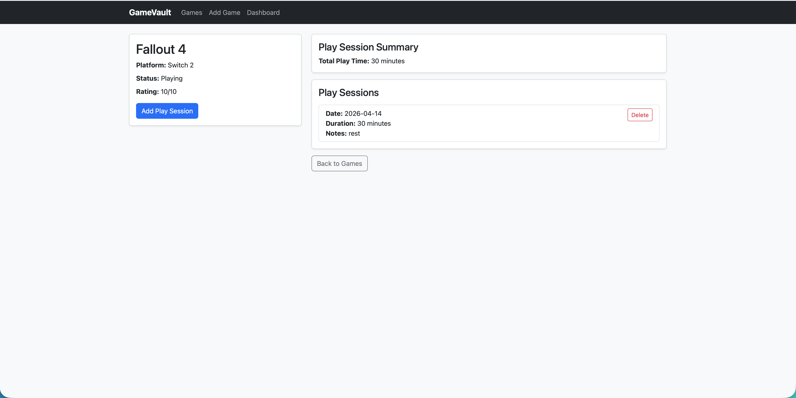
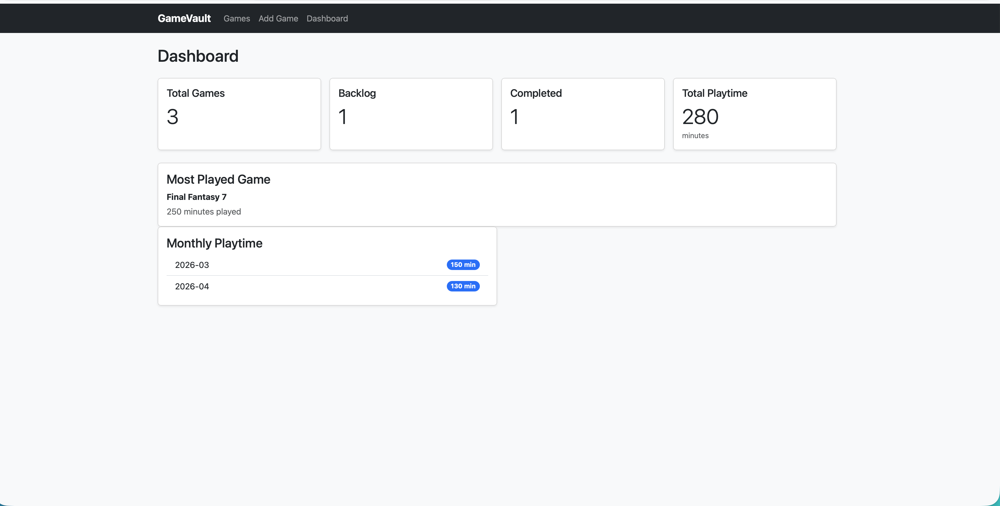

# 🎮 GameVault

GameVault is a Flask-based web application for tracking your video game collection and playtime.

It allows users to manage their game library, log play sessions, and view aggregated statistics like total playtime and most played games.

---

## 🚀 Features

- ✅ Add, edit, and delete games
- ✅ Track play sessions (date, duration, notes)
- ✅ View game detail pages with session history
- ✅ Dashboard with:
  - Total games
  - Backlog and completed counts
  - Total playtime
  - Most played game
  - Monthly playtime breakdown
- ✅ Clean, responsive UI using Bootstrap

---

## 🛠 Tech Stack

- **Backend:** Python, Flask  
- **Database:** SQLite  
- **ORM:** SQLAlchemy  
- **Frontend:** HTML, Jinja Templates, Bootstrap  
- **Version Control:** Git & GitHub  

---

## 📸 Screenshots

> *(Add screenshots here — highly recommended)*

### Games List


### Game Detail


### Dashboard


---

## ⚙️ How to Run Locally

1. Clone the repository:
```bash
git clone https://github.com/justingain/gamevault.git
cd gamevault
```
2. Create a virtual environment:
```bash
python3 -m venv venv
source venv/bin/activate
```
3. Install dependencies:
```bash
pip install -r requirements.txt
```
4. Run the app:
```bash
python.app.py
```
5. Open in your browser:
```
http://localhost:5001
```

## 🧠 What I Learned

This project helped me develop practical experience with:

* Building full CRUD applications using Flask
* Designing relational database models (one-to-many relationships)
* Handling form data and validation
* Writing aggregate queries for analytics (SUM, GROUP BY)
* Structuring multi-page applications with Jinja templates
* Improving UI/UX using Bootstrap
* Using Git and GitHub for version control and project management

---

## 🔮 Future Improvements (Optional)

* Search and filtering
* Data visualization (charts for playtime)
* User authentication
* API integration (e.g., game metadata)

---

## 📄 License

This project is for educational and portfolio purposes.